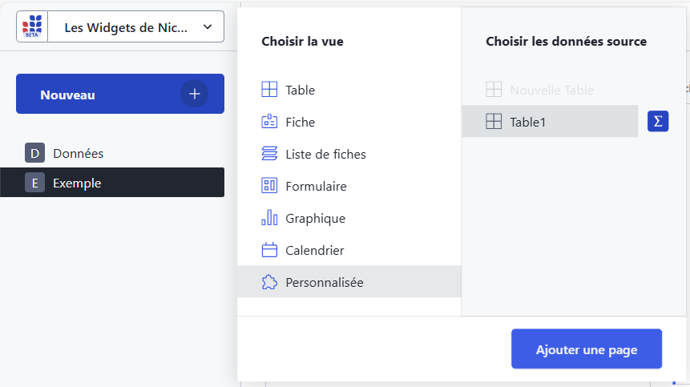
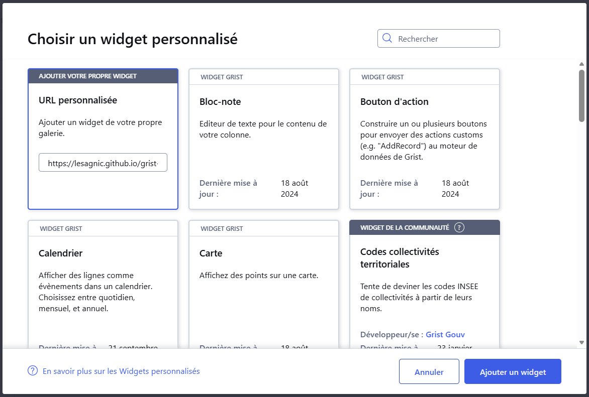

<!-- Improved compatibility of back to top link: See: https://github.com/othneildrew/Best-README-Template/pull/73 -->

    
<!--
<!-- PROJECT SHIELDS -->
<!--
*** I'm using markdown "reference style" links for readability.
*** Reference links are enclosed in brackets [ ] instead of parentheses ( ).
*** See the bottom of this document for the declaration of the reference variables
*** for contributors-url, forks-url, etc. This is an optional, concise syntax you may use.
*** https://www.markdownguide.org/basic-syntax/#reference-style-links
-->
[![Contributors][contributors-shield]][contributors-url]
[![Forks][forks-shield]][forks-url]
[![Stargazers][stars-shield]][stars-url]
[![Issues][issues-shield]][issues-url]
[![Unlicense License][license-shield]][license-url]
[![LinkedIn][linkedin-shield]][linkedin-url]

<!-- ABOUT THE PROJECT -->
## A propos

[![Product Name Screen Shot][product-screenshot]](https://grist.numerique.gouv.fr/o/lesagnic/prQvArMTMKxv/Explorateur/p/2)

Le contenu de la table liée à l'explorateur peut-être visualisée comme une simple liste de libellés ou comme sur cet exemple comme un arbre regroupant les libellés en catégorie et sous-catégories.

Les widgets connectés affichent la ligne de la table sélectionnée dans l'explorateur. Le widget explortauer permet ainsi de naviguer dans le contenu de la table. 

### Construit à partir de : [![Grist][grist-plugin-api.js]][Grist-url]

(<a href="#readme-top">back to top</a>)

<!-- GETTING STARTED -->
## Pour commencer...

### Prérequis

Disposer dans un document GRIST d'une table contenant a minima une colonne pouvant servir de libellé. Cette table peut contenir une ou plusieurs colonnes permettant d'organiser les libelles en catégories ou sous-catégories ainsi que d'autres colonnes d'informations.

### Mise en oeuvre

Dans une page du document GRIST éventuellement créée pour l'occasion, ajoutez une vue personnalisée associée à votre table :

Sélectionnez le widget de type **URL Personnalisée** et copiez l'URL **'https://lesagnic.github.io/grist-widget-explorer/widget'** dans la zone URL du widget et cliquez sur **Ajouter**.

(<a href="#readme-top">back to top</a>)

<!-- MARKDOWN LINKS & IMAGES -->
<!-- https://www.markdownguide.org/basic-syntax/#reference-style-links -->
[contributors-shield]: https://img.shields.io/github/contributors/lesagnic/grist-widget-explorer.svg?style=plastic
[forks-shield]: https://img.shields.io/github/forks/lesagnic/grist-widget-explorer.svg?style=plastic
[stars-shield]: https://img.shields.io/github/stars/lesagnic/grist-widget-explorer.svg?style=plastic
[issues-shield]: https://img.shields.io/github/issues/lesagnic/grist-widget-explorer.svg?style=plastic
[license-shield]: https://img.shields.io/github/license/lesagnic/grist-widget-explorer.svg?style=plastic
[linkedin-shield]: https://img.shields.io/badge/-LinkedIn-black.svg?style=plastic&logo=linkedin&colorB=555 
[contributors-url]: https://github.com/lesagnic/grist-widget-explorer/graphs/contributors
[forks-url]: https://github.com/lesagnic/grist-widget-explorer/network/members
[stars-url]: https://github.com/lesagnic/grist-widget-explorer/stargazers
[issues-url]: https://github.com/lesagnic/grist-widget-explorer/issues
[license-url]: https://github.com/lesagnic/grist-widget-explorer/blob/main/LICENSE
[linkedin-url]: https://www.linkedin.com/in/nicolas-lesage-1a2049b0/
[product-screenshot]: assets/img/screenshot.png
[grist-plugin-api.js]: https://img.shields.io/badge/grist-grist--plugin--api.js-000000?style=plastic&labelColor=F7AF40
[Grist-url]: https://support.getgrist.com/code/modules/grist_plugin_api/
